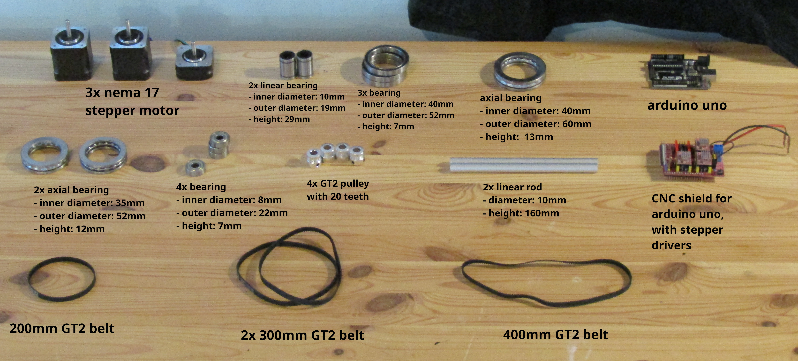
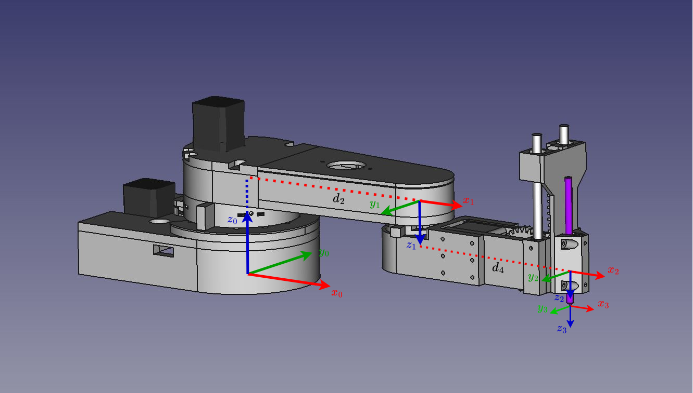
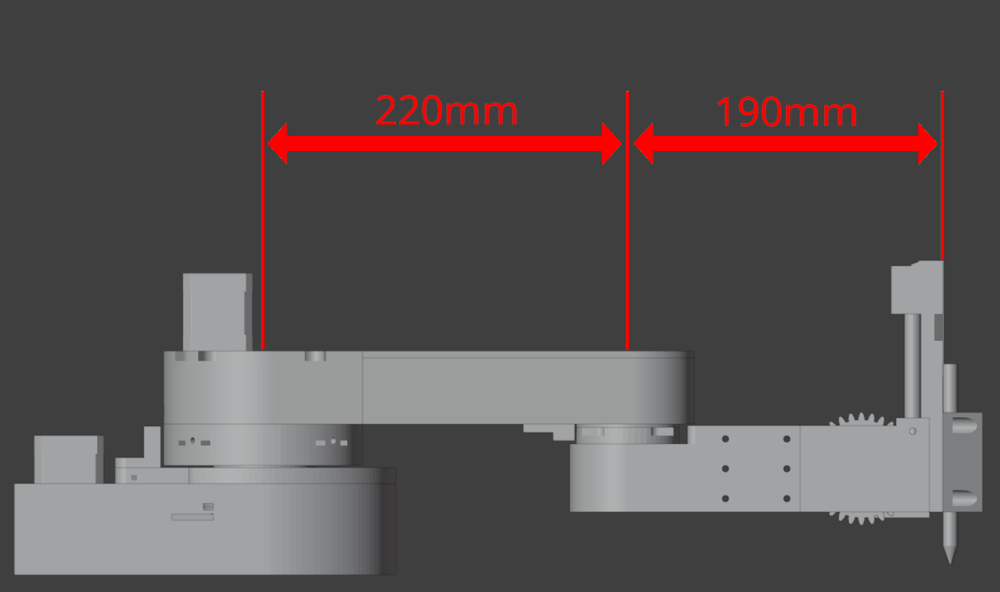

# Drawing Robot

This project is about a 3d printed **drawing robot** I made in my first year of computer engineering in 2023, to understand more in depth how a CNC machine works.  
It was 3D modeled in *FreeCAD* and programmed for an *Arduino Uno*, from scratch: from the classes that control the stepper motors, to the GCODE functions that draw.  

---

## The Robot

**The robot** is a scara manipulator with 3 degrees of freedom, that uses nema 17 stepper motors with gt2 belts and pulleys to reach a ratio of 20:1 for the first joint and 15:1 for the second joint.  
For the last joint we have a simple rack and pinion mechanism to convert the rotation of the stepper motor into a linear motion that moves the end effector (pen) to draw or not in the drawing plane.  

The code is divided in 4 *Arduino* files:
- [Scara_Manipulator_V1](code/arduino/Scara_Manipulator_V1.ino): it's the main where the classes for the stepper motors and the manipulator are declared, and the manipulator object is created.
- [CNCstepperClass](code/arduino/CNCstepperClass.ino): where the class for the stepper motors is defined.
- [ManipulatorClass](code/arduino/ManipulatorClass.ino): where the manipulator class is defined, with its functions that use the inverse kinematics to control the robot.
- [FunzioniGCODE](code/arduino/FunzioniGCODE.ino): where the GCODE functions of the manipulator class are defined.  

  
To be able to visualize the robot to the fullest, there is the *Blender* file: [Scara Manipulator](3D-models/Scara%20Manipulator.blend)

---

## Robot in Action

The robot draws the letter "A".  

The robot draws a smiling face.  

The robot draws a butterfly.  

---

## Components
The robot was made in *FreeCAD* and designed to be able to be 3D printed in PLA with a cheap 3D printer.  
In addition we need the following components:

---

## Robot Diagram
The robot has a very simple diagram, and in particular, since the objective is to draw, we don't need a complicated control for the $z$ axis, and so we can have 2 values for $z$: the value where the end effector (pen) is touching the drawing plane, and the value where it doesn't.  
As a result in the diagram we don't need the measurements for the vertical link, but only the horizontal ones $d_2$ and $d_4$

---

## Inverse Kinematics
The **inverse kinematics** is very simple, not only because we have a 3 degrees of freedom manipulator, but also because with the simplification of the $z$ axis, discussed earlier, we need to consider only $d_2$ and $d_4$, and calculate $\theta_1$ and $\theta_2$ (the angles of the first 2 joints respectively)  
For $\theta_3$ we need only to know the 2 values that allow the end effector (pen) to touch or not the drawing plane.

In the following image we have a diagram that shows the robot from the top in 2 possible configurations: the one where the desired $y_0$ is greater than $0,$ and the one where it's less than $0$. 

---
